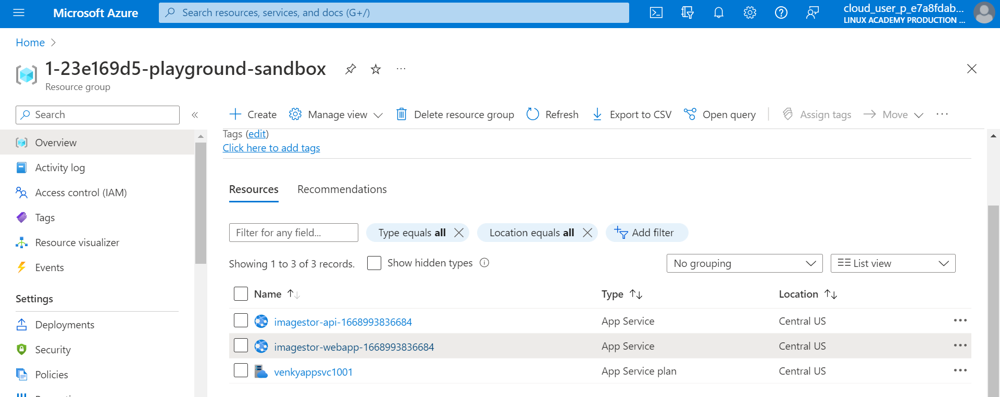

## Steps to deploy
* We need to make sure we install the az cli tools.
* We need to run the powershell scripts in  Windows powershell.
* First we login to azure from the powershell terminal 
    * az login
* Once the login is good, we need to execute this to create the application service plan. This will read the subscription, location, and the resource group from the logged in account, and use it as parameters to create the app service plan.
    * 1001-create-app-service-plan.ps1
* Once the app service is created, we use the azure-webapp-maven plugin to push the build to azure. Note the pom.xml parameters passed. The powershell was not able to pass the variables directly, so wrapped it with a bat file and used parameters instead. 
    * 1002-deploy_app.ps1
* After the webapp is deployed, we need to turn our attention to the API and deploy that too. 
    * change directory to imgstorapi and run the deploy_app.ps1 to push the API also to the same app service plan. 

