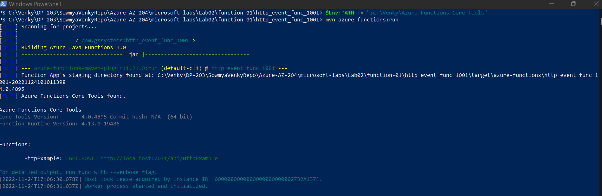
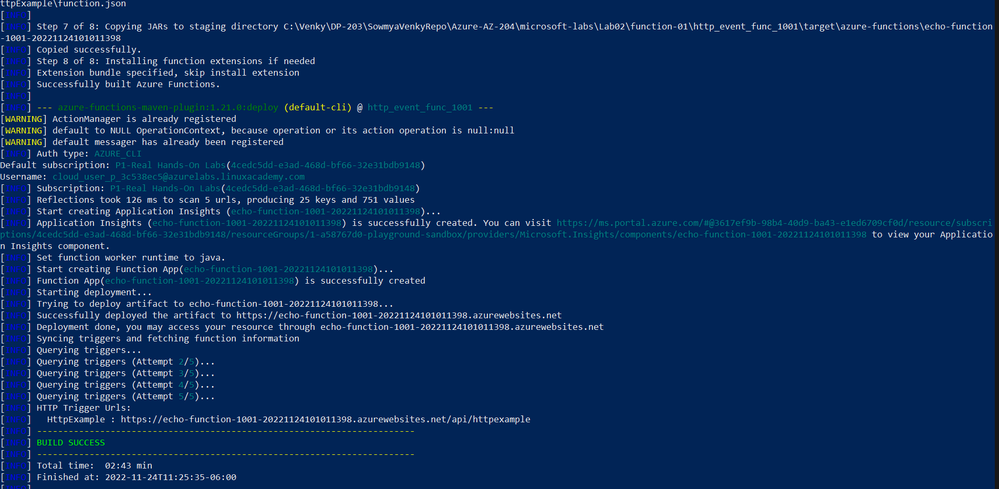
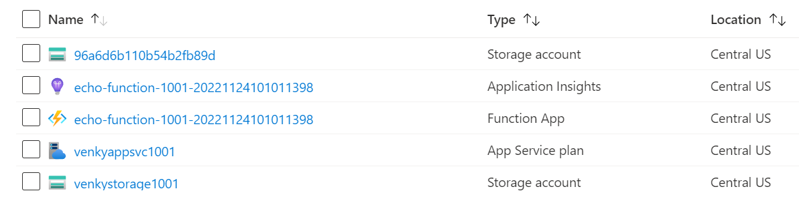
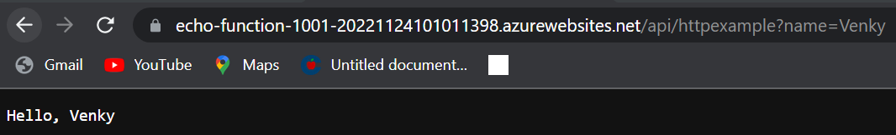

## Create a simple function that will respond to HTTP Triggers.
* Follow the instructions in the Run_Instructions.txt file to see the steps needed to get the function tested locally.

## Functions app running locally.

## Azure deployment 

