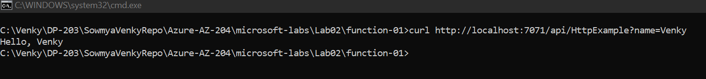

## Create a simple function that will respond to HTTP Triggers.
* Follow the instructions in the Run_Instructions.txt file to see the steps needed to get the function tested locally.

## Functions app running locally.

## Azure deployment 

## Function that can be triggered on a schedule.
* To develop functions that can be triggered on a schedule, it looks like a blob storage account is required. To test this on the local machine, we need a few dependencies installed and started to emulate the blob storage in Azure on the local machine. The tool of choice for this is called Azurite, and that can be easily installed if we have VS Code. If we do not want VSCode, then we can install node and then install Azurite through the npm command. Here are the details for this process. https://learn.microsoft.com/en-us/azure/storage/common/storage-use-azurite?tabs=visual-studio

* Once we have the Azurite installed, we need to open the command pallette (Control + Shift + P)
* If we type Azurite in the text box, it will show us a command to start the azure blob storage emulator. 
* Once the emulator is started, it will say that it is running on http://127.0.0.1:10000. Once this is running, we can test the scheduled functions. 
* We need to install the Azure Core tools from here https://aka.ms/azfunc-install and add it to the path variable along with maven bin folder. 
* We need to set JAVA_HOME environment variable. 
* Then we can do the mvn clean package -DskipTests=true. This will actually go through all the steps and create a staging folder for the azure functions to run. The problem I faced with this is that it writes out a local.settings.json file with no mention of storage for webjobs, and without that setting it fails. I had to create a local.settings.json that had this setting under the Values "AzureWebJobsStorage": "UseDevelopmentStorage=true",
* Once all this is in place, we can do mvn azure-functions:run, and this will start the functions in the jar file. I have both HTTP trigger and time scheduled functions in the same jar file. 
* Once the cron trigger starts, the messages fire in the log every time the function runs. 
 
 