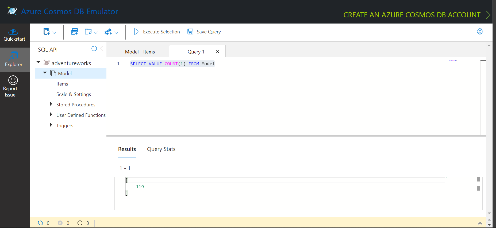

# Polyglot Persistence web application 

1. In this application we will demonstrate how we can make the spring boot application serve the data from two different endpoints.
* The image data is stored from the blob storage container that is created with public access. 
* The model data is stored in a cosmos DB. The data is in the JSON format, and hence can be queried using the Cosmos Table API. 

1. Sign in to your Azure account using Azure CLI:

```azurecli
az login
1001-create-cosmos-db-acct.ps1
1002-create-storage-account
1003-get-cosmos-data
```

## Build the application

1. Use Maven to build the application.

   ```bash
   mvn clean package 
   mvn spring-boot:run
   ```

## Using Azurite for local blob storage simulation, and cosmos DB emulator to serve cosmos DB data locally

* Download and install the cosmos DB emulator. 
* Download and install VS code. It is easier to install the extension for Azurite. 
* Once you have VSCODE, we can start VSCode and open the directory containing this project. 
* From the bottom taskbar, we can star the Azurite Azure Blob Service. This will start a storage account emulator locally on http://127.0.0.1:10000
* Start the cosmos DB emulator and capture the keys to access it. 
* Start the spring boot program with the profile local - This will make sure that the application-local.properties is used and it connects to both local cosmos and Azurite. 

mvn spring-boot:run -Dspring-boot.run.profiles=local

* All the commands used to run this project locally are documented in Run_Instructions.txt





