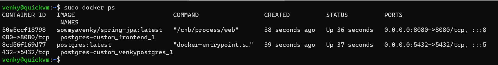

## Lab 05

This lab demonstrates the usage of both IaaS and ACI to host a containerized solution on Azure.
* We will create a Linux virtual machine called quickvm
* Mext we will install docker on it.
* Next we will create a Azure Container Registry (ACR).
* We will build the image of the app on the linux vm and push the image over to the ACR
* Once the image is pushed, we can use that on ACI to deploy and test the application.

