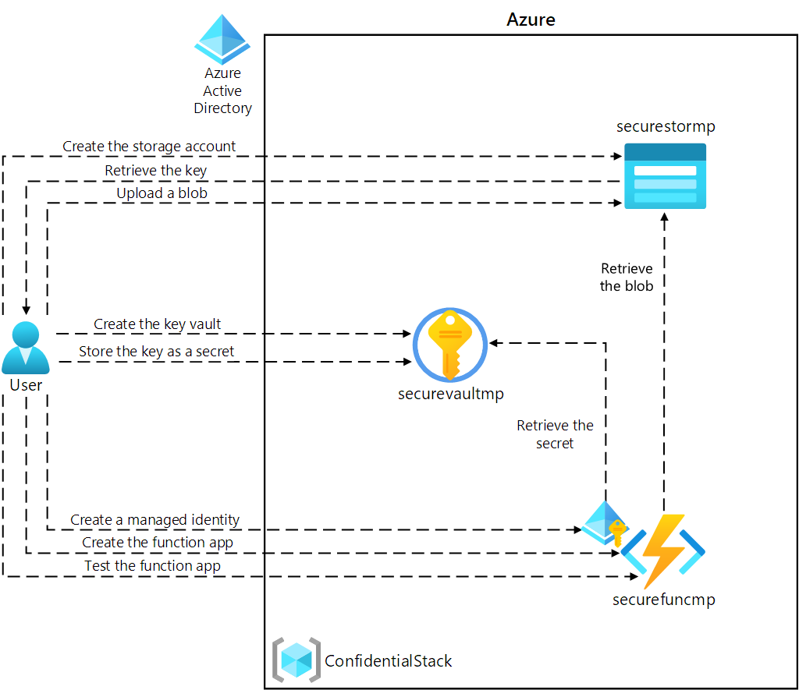

## Lab 07

This lab demonstrates the usage of key-vault in Azure.
* We will create a storage account in our resource group. 
* We will get the access keys to the storage account. 
* We will create a new key-valult.
* We will store the access key for the storage account inside the key-vault. 
* We upload a blob to the storage account. (records.json)
* We create an Azure function. This function will connect to the key-vault, get the key to the storage account, and then use it to pull down the blob we have inside the storage account container. 
* A managed identity is created and assigned to the function. 
* A vault access policy is created to allow the managed identity of the function read access to the storage key inside the vault.

* It looks like when we run the maven deploy to push the function to Azure, it configures an app service plan, and a functions app inside that plan. I tried to put the values of our plan but it did not seem to take it. Need some more testing to be done on how to make this work. It looks like the Azure portal creates a plan called regionname-plan and puts the function under it when we create it via the portal. 

* Final product. The function uses key-vault client and the blob client, fetches the connection string from within the key-vault and lists all the blobs in the container! 

